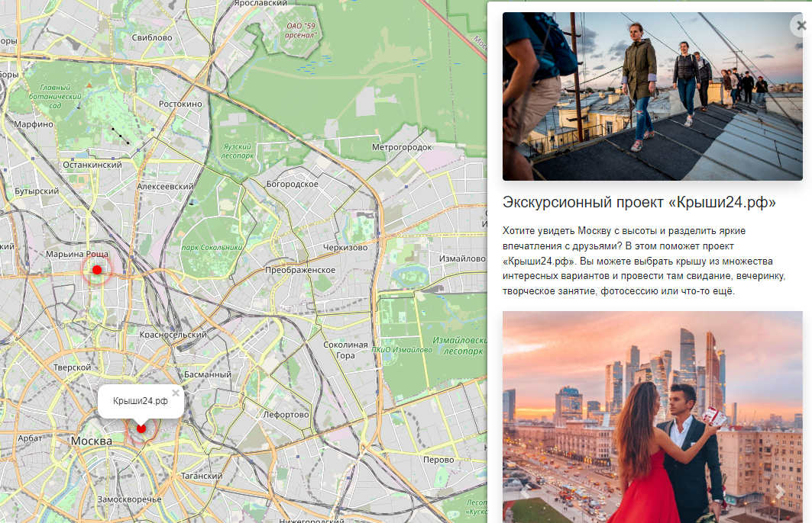

# -where-to-go

Project created to share interesting Moscow places and give some information about it. 

Starting server create map, where marked places from database with their description and photos.

Link for working site: https://hardrope.pythonanywhere.com/

## Preview



## Install

 1. Clone repository:

```commandline
git clone https://github.com/HardRope/-where-to-go
```

 2. Install requirements:

```commandline
pip install -r requirements.txt
```

 4. Make migrations:

```commandline
python3 manage.py makemigrations

python3 manage.py migrate
```

 5. Create `.env` and add data:

```commandline
SECRET_KEY= secret_key
DEBUG= debug setting: true of false
ALLOWED_HOSTS= hosts. For local: 127.0.0.1, .pythonanywhere.com

STATIC_URL= your static files url. Format: '/static_url/'
STATIC_ROOT= your static files dir name

MEDIA_URL= media files url.  Format: '/media_url/'
MEDIA_ROOT= media files dir name
```

 6. Create super user to django access:

```commandline
python3 manage.py createsuperuser
```

## Help function

To loading places info from url with JSON-data< looking like:

```commandline
{
    "title": "Place_name",
    "imgs": [
        list of images urls
    ],
    "description_short": short descriptions (str)
    "description_long": long description (may contains html-tags)
    "coordinates": {
        "lng": "99.99999",
        "lat": "99.9999999"
    }
```
